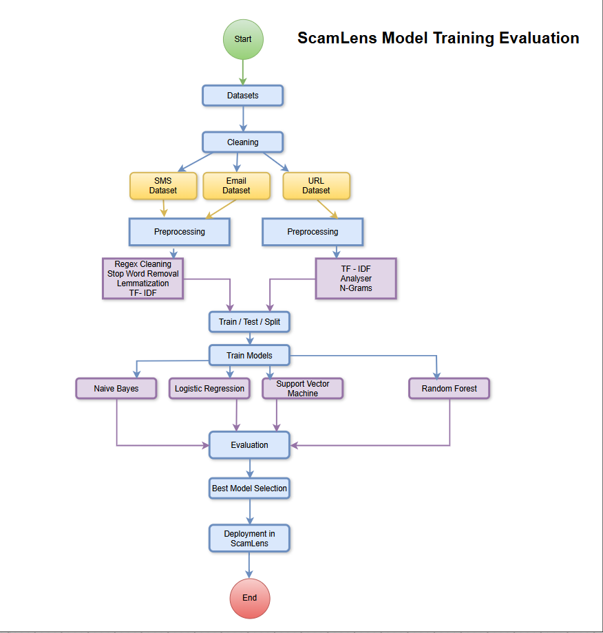
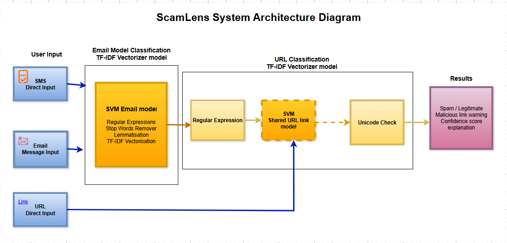
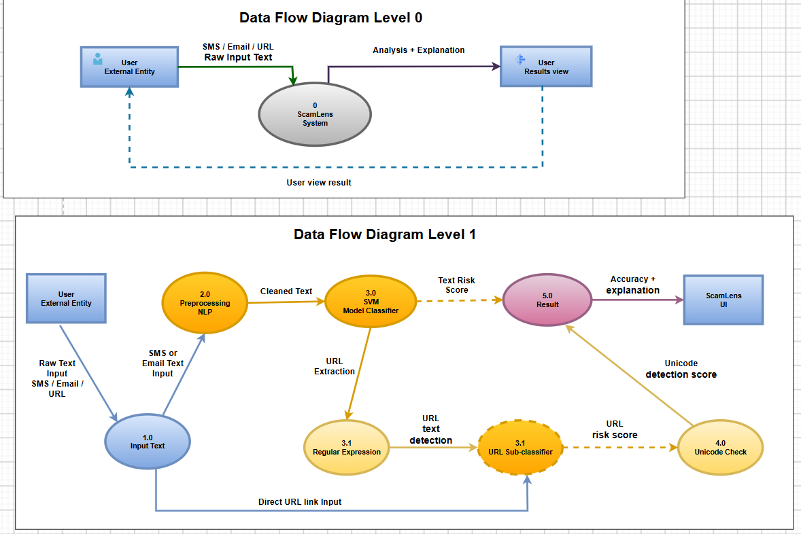
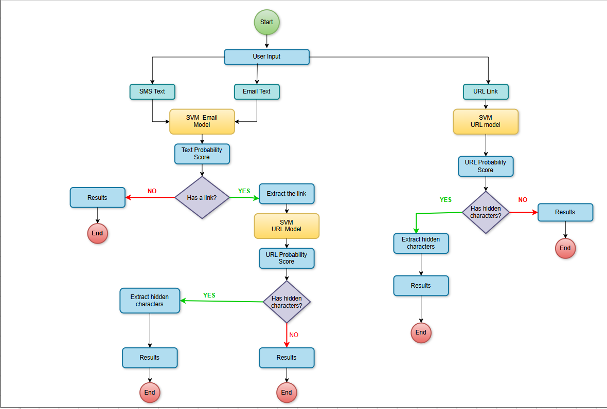

# System Design and Architecture

## Overview

This document presents the design and architecture of ScamLens. It explains how the machine learning models were trained, evaluated and selected before being integrated into the application. The diagrams also demonstrate how user input moves through the system, how the content is analysed and how the final results are presented.

## 1. Model Training and Evaluation

The model training process started with the collection and cleaning of the SMS, email and URL datasets. Following the initial cleaning, each dataset passed through the preprocessing steps required for its type of content.

The SMS and email content was prepared using natural language processing techniques. These included regular expression cleaning, stop-word removal, lemmatisation and TF-IDF vectorisation. The URL content was prepared using TF-IDF analysis and character n-grams to identify patterns within potentially malicious links.

After preprocessing, each dataset was divided into training and testing sets. Four supervised machine learning algorithms were trained and compared: Naïve Bayes, Logistic Regression, Support Vector Machine and Random Forest. Their performance was evaluated using accuracy, precision, recall, F1-score and confusion matrices.

The best-performing models were selected based on their evaluation results and practical pre-testing. Although a separate SMS model was initially trained, pre-testing demonstrated that it did not classify the example spam messages reliably. Therefore, the separate SMS model was excluded from the final system design.

The selected SVM email and URL models were saved using Joblib and deployed within the ScamLens application. SMS and email text is processed by the selected email classification model because both inputs contain similar text-based characteristics.

## 2. ScamLens System Architecture

The ScamLens system architecture demonstrates how SMS messages, email content and URLs are processed by the application. It combines text classification, URL classification and Unicode detection to provide a more detailed analysis.

SMS and email inputs are passed to the selected SVM email classification model. Before classification, the submitted content is processed using regular expressions, stop-word removal, lemmatisation and TF-IDF vectorisation. The model then produces a text classification and probability score.

The regular expression process also checks whether the submitted SMS or email contains a URL. When a link is identified, it is extracted and transferred to the shared SVM URL classification model for additional analysis. A URL entered directly by the user is sent to the same URL model without passing through the email classifier.

After URL classification, the link passes through the Unicode-checking process. This additional check identifies hidden Unicode characters and visually similar letters that could be used to disguise a malicious web address.

The results from the different analysis processes are combined and displayed to the user. The final output can include a spam or legitimate prediction, malicious-link warning, probability score and short explanation of the result.

## 3. Data Flow Diagrams

### 3.1 Data Flow Diagram – Level 0

The Level 0 Data Flow Diagram provides a general view of the interaction between the user and ScamLens. It presents the complete application as one main process without showing its individual internal components.

The user submits raw SMS, email or URL content to the ScamLens system. The application receives and analyses the input before returning the prediction and explanation through the user interface.

No data store is included in the diagram because ScamLens does not save the content entered by the user. The submitted information is used only to produce the current analysis result.

### 3.2 Data Flow Diagram – Level 1

The Level 1 Data Flow Diagram provides a more detailed view of the internal processes. It demonstrates how the content moves between input, preprocessing, classification, Unicode detection and the final result.

The process starts when the user submits raw SMS, email or URL content. SMS and email text passes through natural language preprocessing, where the content is cleaned and prepared for classification. The cleaned text is transferred to the SVM classifier, which produces a text prediction and probability score.

The system also applies a regular expression to detect and extract any URL included in the submitted text. The extracted link is passed to the URL sub-classifier. A URL entered directly by the user is transferred immediately to the same classification process.

The URL classifier produces a risk score, which is passed to the Unicode-checking process. This process checks the link for hidden or substituted characters. The text prediction, URL risk score and Unicode-detection result are then combined to produce the final analysis.

The ScamLens interface presents the result to the user together with the probability score, warning and explanation.

## 4. ScamLens System Flowchart

The system flowchart presents the complete decision-making process followed by ScamLens. The process begins when the user selects the required analysis type and enters an SMS message, email or URL.

SMS and email content is processed by the SVM email model, which produces a text probability score. The system then checks whether the submitted content contains a URL.

If no link is detected, the text classification and probability score are displayed directly to the user. If a link is found, the system extracts it and sends it to the SVM URL model. The URL model calculates a separate URL probability score.

A URL entered directly by the user is sent immediately to the SVM URL model. Following URL classification, the system checks whether the address contains hidden Unicode characters or substituted letters.

If suspicious characters are detected, the system includes an additional warning in the result. If no hidden characters are found, the URL classification is presented without the Unicode warning. The process finishes when the complete result is displayed to the user.

## Architecture Summary

The ScamLens architecture combines text classification, URL analysis and Unicode detection within a single Streamlit application. The separate analysis processes allow the system to examine different indicators of suspicious content before presenting the result.

The architecture supports the project requirements for accessibility, user privacy, fast analysis and understandable feedback. It also demonstrates how the machine learning models, preprocessing functions and user interface work together to provide the final ScamLens service.

---

[← Back to the main README](../README.md) | [Next: Prototype Design →](04_Prototype_Design.md)