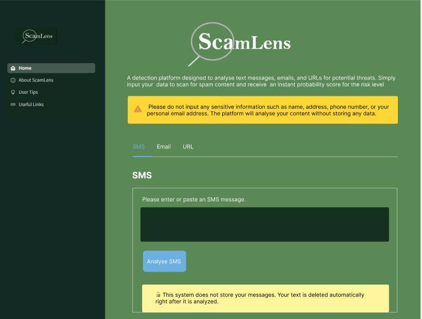
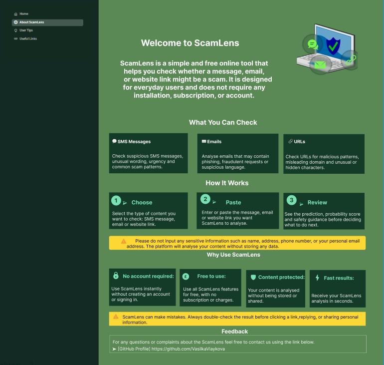
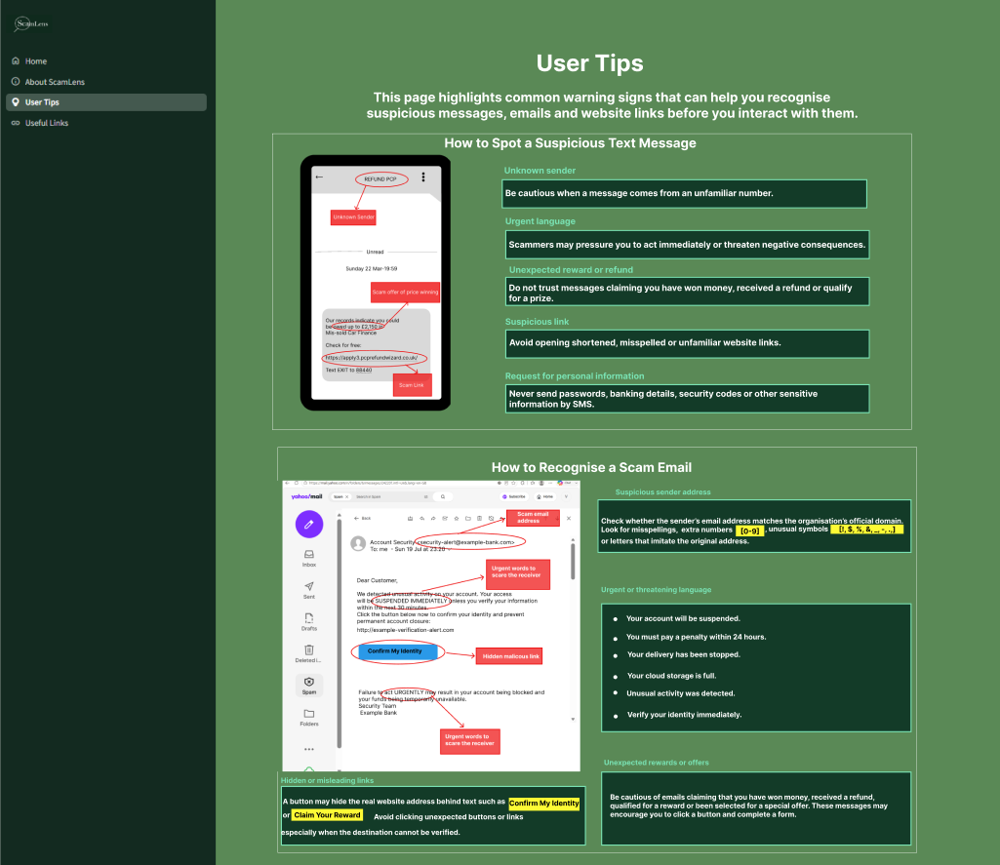
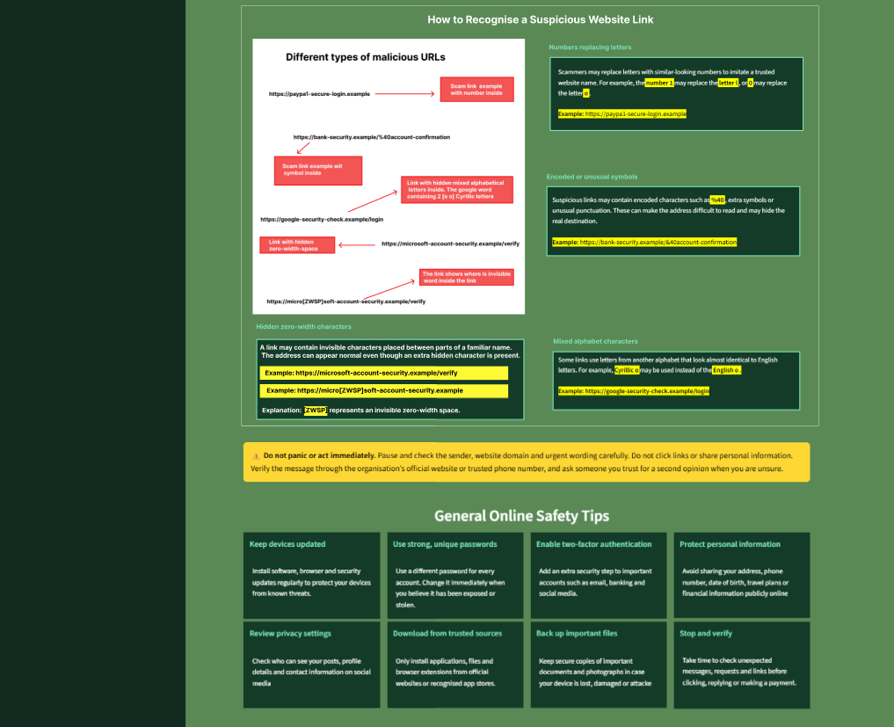
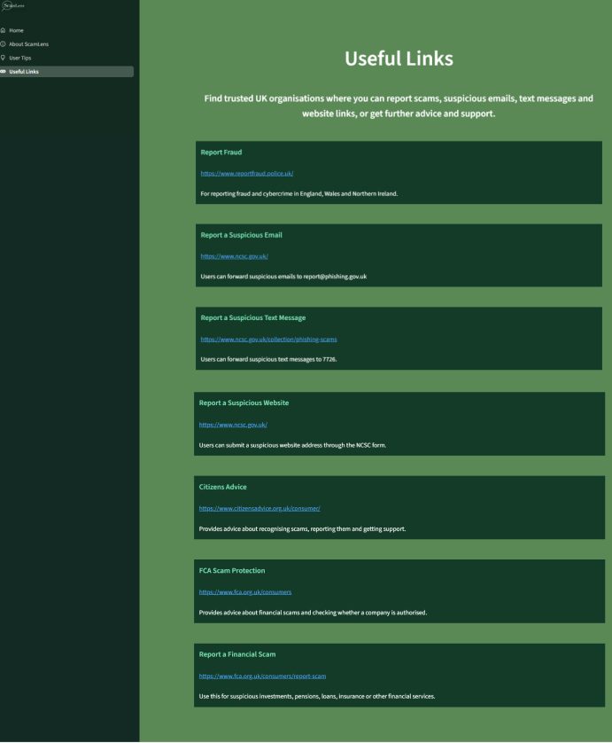

# Prototype Design

## Overview

This document presents the prototype design of the ScamLens web application. The prototype was developed to demonstrate the system’s interface, navigation, content-analysis options, safety guidance and reporting resources.

The design was influenced by the project research and functional requirements. Its main purpose was to create a simple and understandable interface that could be used by people without technical knowledge. The prototype includes the Home page, About ScamLens page, User Tips page and Useful Links page.

## 1. Home Page

The Home page provides the main content-analysis functions of ScamLens. A navigation menu is positioned on the left side and remains accessible throughout the application. It allows the user to move between Home, About ScamLens, User Tips and Useful Links.

The centre of the page contains the ScamLens title, a short explanation of the system and a visible warning advising users not to enter personal or sensitive information. The warning is displayed in a yellow box so that it can be easily noticed before any content is submitted.

The analysis interface is divided into three tabs for SMS messages, emails and URLs. Each tab provides a text box where the user can enter or paste the relevant content. A clearly visible analysis button allows the content to be submitted to the selected machine learning model.

A privacy message below the input area informs users that their submitted content is not stored and is removed after the analysis. The interface uses a dark-green navigation area, a light-green background, blue buttons and yellow warning boxes to create clear visual separation between different elements.

## 2. About ScamLens Page

The About ScamLens page introduces the purpose of the application and explains its main functions. It informs users that ScamLens is a simple and free online tool that can examine messages, emails and website links without requiring installation, registration, payment or an account.

The “What You Can Check” section is divided into three visual boxes representing SMS messages, emails and URLs. Each box provides a short explanation of the type of suspicious content that the system can analyse.

The “How It Works” section explains the process through three simple stages: **Choose**, **Paste** and **Review**. The numbered layout helps users understand how to use the application before submitting content.

The page also explains the main benefits of ScamLens, including no account requirement, free access, content protection and fast results. Warning messages remind users not to enter personal information and to verify the result before clicking a link, replying to a message or sharing sensitive information.

A feedback section is included at the bottom of the page. It provides a link that users can follow if they have questions or complaints about the system.

## 3. User Tips – SMS and Email Guidance

The first part of the User Tips page provides guidance for recognising suspicious SMS messages and emails. The page combines short explanations with annotated examples to make the warning signs easier to understand and remember.

The SMS section highlights common indicators such as an unknown sender, urgent language, unexpected rewards, refund claims, suspicious links and requests for personal information. A realistic mobile-message example demonstrates how these signs may appear in an actual scam message.

The email section explains how users can recognise a suspicious sender address, urgent or threatening language, unexpected offers and hidden links. An annotated email example shows how scammers may use spelling variations in an address, urgent account warnings and misleading buttons to encourage users to interact with fraudulent content.

The use of realistic examples supports users who may not understand technical cybersecurity terms. Important information is separated into bordered content boxes, while highlighted words and arrows direct attention to the suspicious elements.

## 4. User Tips – URL and General Safety Guidance

The second part of the User Tips page explains how to recognise suspicious website links. It presents examples of URLs containing numbers that replace letters, encoded characters, unusual symbols, mixed alphabets and hidden zero-width characters.

The annotated URL image demonstrates how a malicious address can appear similar to a legitimate website. Additional explanation boxes describe how scammers may disguise links by inserting invisible characters or letters from other alphabets that resemble English letters.

A visible warning box advises users not to panic or act immediately when they receive suspicious content. Users are encouraged to pause, check the sender, examine the website domain and verify the message through the organisation’s official website or trusted contact details.

The General Online Safety Tips section provides additional recommendations, including keeping devices updated, using strong and unique passwords, enabling two-factor authentication, protecting personal information, reviewing privacy settings and downloading files only from trusted sources.

The section also advises users to keep backups of important files and to stop and verify unexpected messages, requests and links before interacting with them.

## 5. Useful Links Page

The Useful Links page provides trusted resources where users can report scams, suspicious messages, emails and website links. It can also be used to find additional information and professional guidance.

The resources are displayed in separate boxes to make them easy to identify and select. Each box contains the organisation’s name, a clickable link and a short explanation of the service it provides.

The page includes links to the following organisations and services:

- Report Fraud
- National Cyber Security Centre
- Suspicious Text Message Reporting
- Suspicious Website Reporting
- Citizens Advice
- Financial Conduct Authority ScamSmart
- Financial Scam Reporting Services

These resources allow users to take further action after receiving a ScamLens prediction. The application therefore provides not only an analysis result but also access to trusted organisations that can provide support or investigate suspicious content.

## 6. Visual Design and Navigation

The prototype uses the same colour scheme, typography and page structure throughout the application. The dark-green sidebar separates the navigation menu from the main content, while the light-green background maintains a consistent appearance across all pages.

Blue is used for interactive elements and selected tabs. Yellow is used for privacy messages, warnings and important information. White text and clearly separated content boxes improve readability against the green background.

The navigation menu remains in the same position on every page. This allows users to move between the analysis interface, system information, safety guidance and useful reporting resources without becoming confused.

Icons, annotated examples, numbered steps and short explanations were included to improve understanding. The consistent layout supports the functional requirement for simple and smooth navigation throughout the application.

## Prototype Summary

The ScamLens prototype demonstrates how the research, requirements and system design were converted into a complete user interface. Each page has a specific purpose, including content analysis, system explanation, scam-awareness guidance and access to official reporting services.

The prototype focuses on accessibility, privacy, understandable information and consistent navigation. Its visual elements and realistic examples help users recognise suspicious content and understand the results provided by the application.

---

[← Previous: System Design and Architecture](03_System_Design_and_Architecture.md) | [Back to the main README](../README.md)